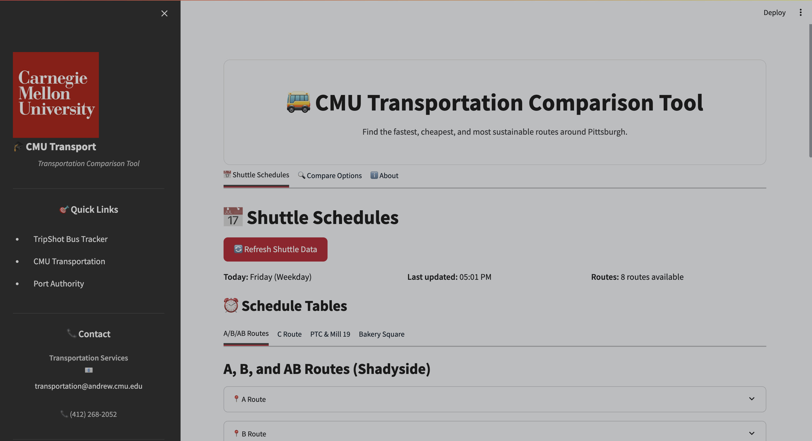
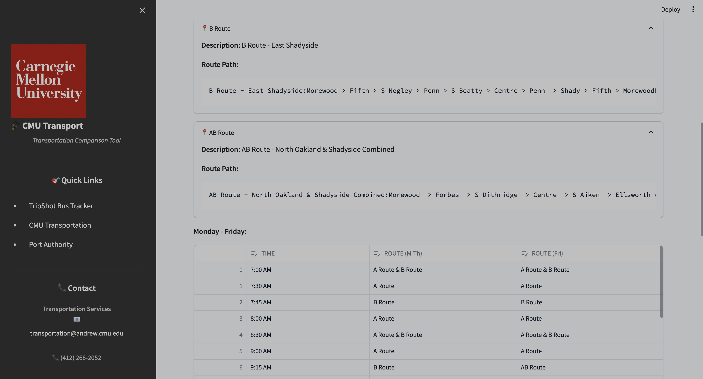
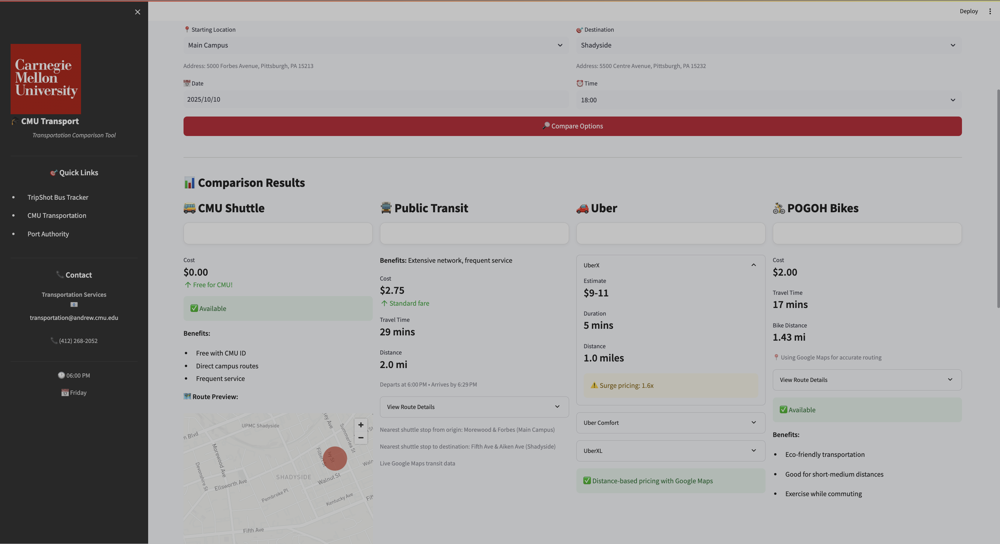

# 🚌 CMU Transportation Comparison Tool

A Python-based web application built with Streamlit that helps Carnegie Mellon University students, faculty, and staff compare transportation options including CMU shuttles, public transit, and ride-sharing services.


## ✨ Features

- **📅 Live Shuttle Schedules**: Real-time CMU shuttle timings scraped from official CMU Transportation Services
- **🚍 Public Transit Integration**: Compare with Port Authority transit options using Google Maps API
- **🚗 Ride-sharing Estimates**: Get Uber pricing and timing estimates via Uber API
- **💰 Cost Analysis**: Compare costs between free shuttles, public transit, and ride-sharing
- **⏱️ Time Comparison**: Find the fastest route for your journey
- **🎨 Modern UI**: Beautiful, responsive interface built entirely in Python using Streamlit

## 🚀 How to Install and Run This Project

### Prerequisites

- Python 3.8 or higher
- pip (Python package installer)


### Installation

1. **Clone the repository**
   ```bash
   cd DFP-TeamBrown
   ```

2. **Create a virtual environment** (recommended)

   Note: The env setup and requirements install code can be found in run.sh commented, uncomment them to execute.

   ```bash
   python -m venv venv
   
   # On macOS/Linux:
   source venv/bin/activate
   
   # On Windows:
   venv\Scripts\activate
   ```

4. **Install dependencies**
   ```bash
   pip install -r requirements.txt
   ```
**Required Python packages (installed via requirements.txt):**
- beautifulsoup4==4.12.3
- requests==2.31.0
- lxml==5.1.0
- pandas==2.2.0
- googlemaps==4.10.0
- python-dotenv==1.0.1

4. **Configure API keys** (optional - app works with mock data without keys)
   ```bash
   cp .env.example .env
   ```
   
   Edit `.env` and add your API keys:
   ```
   GOOGLE_MAPS_API_KEY=your_google_maps_api_key_here
   UBER_ACCESS_TOKEN=your_uber_access_token_here
   ```

5. **Run the application**
   ```bash
   streamlit run app.py
   ```

6. **Open your browser**
   
   The app will automatically open at `http://localhost:8501`

## 📁 Project Structure

```
DFP-TeamBrown/
├── app.py                      # Main Streamlit application
├── requirements.txt            # Python dependencies
├── README.md                   # This file
├── .env.example               # Example environment variables
├── .gitignore                 # Git ignore rules
├── src/                       # Source code modules
│   ├── __init__.py           # Package initialization
│   ├── scraper.py            # CMU shuttle schedule scraper
│   ├── google_transit.py     # Google Maps API integration
│   ├── uber_api.py           # Uber API integration
│   └── utils.py              # Utility functions
└── data/                      # Data directory (cached data, etc.)
    └── .gitkeep
```

## 🔧 Configuration

### API Keys (Optional)

The application works with mock data by default, but you can enable real-time data by providing API keys:

#### Google Maps API
1. Go to [Google Cloud Console](https://console.cloud.google.com/)
2. Create a new project or select existing one
3. Enable the **Directions API** and **Maps JavaScript API**
4. Create credentials (API Key)
5. Add the key to `.env` as `GOOGLE_MAPS_API_KEY`

#### Uber API
1. Register at [Uber Developer Portal](https://developer.uber.com/)
2. Create a new app
3. Get your Server Token
4. Add the token to `.env` as `UBER_ACCESS_TOKEN`

## 📖 Usage

### 1. View Shuttle Schedules

Navigate to the **Shuttle Schedules** tab to:
- View all CMU shuttle routes (A, B, AB, C, PTC, Mill 19, Bakery Square)
- Check schedules for weekdays and weekends
- See route paths and descriptions
- Refresh data in real-time

### 2. Compare Transportation Options

Navigate to the **Compare Options** tab to:
- Select your starting point and destination from CMU locations
- Choose your travel date and time
- Compare costs and travel times across all options
- View detailed route information
- Get recommendations based on your needs

### 3. Testing the Scraper

You can test the web scraper independently:

```bash
cd src
python scraper.py
```

This will fetch and display the current shuttle schedule data.

## 🛠️ Development

### Testing Individual Modules

Each module can be tested independently:

```bash
# Test the scraper
python src/scraper.py

# Test utilities
python src/utils.py

# Test Google Transit API (with mock data)
python src/google_transit.py

# Test Uber API (with mock data)
python src/uber_api.py
```

### Adding New Features

The modular structure makes it easy to add new features:

1. **Add a new transportation mode**: Create a new module in `src/`
2. **Extend the UI**: Modify `app.py` to add new tabs or sections
3. **Add utilities**: Extend `utils.py` with helper functions

## 📊 Data Sources

- **CMU Shuttle Schedules**: [CMU Transportation Services](https://www.cmu.edu/transportation/transport/shuttle.html)
- **Live Bus Tracking**: [TripShot App](https://cmu.tripshot.com)
- **Public Transit**: Google Maps Directions API
- **Ride-sharing**: Uber API

## 🎯 Key Technologies

- **[Streamlit](https://streamlit.io/)**: Web application framework
- **[BeautifulSoup4](https://www.crummy.com/software/BeautifulSoup/)**: Web scraping
- **[Pandas](https://pandas.pydata.org/)**: Data manipulation
- **[Google Maps API](https://developers.google.com/maps)**: Transit directions
- **[Uber API](https://developer.uber.com/)**: Ride estimates

## 🚧 Future Enhancements

- [ ] Real-time shuttle tracking integration with TripShot API
- [ ] Historical data analysis and predictions
- [ ] Lyft API integration
- [ ] Weather-based recommendations
- [ ] User preferences and saved routes
- [ ] Mobile app version
- [ ] Push notifications for shuttle arrivals
- [ ] Carbon footprint comparison

## 📸 Application Screenshots

### Main Interface

*The main CMU Transportation Comparison Tool interface showing the three main tabs*

### Shuttle Schedules Tab  

*Live CMU shuttle schedules with route information and timetables*

### Transportation Comparison

*Side-by-side comparison of shuttle, transit, and ride-sharing options*

**Note:** Screenshots show the actual application interface to help users understand the tool's functionality.

## 🤝 Contributing

Contributions are welcome! Here's how you can help:

1. Fork the repository
2. Create a feature branch (`git checkout -b feature/AmazingFeature`)
3. Commit your changes (`git commit -m 'Add some AmazingFeature'`)
4. Push to the branch (`git push origin feature/AmazingFeature`)
5. Open a Pull Request

## ⚠️ Disclaimer

This tool is not officially affiliated with Carnegie Mellon University or CMU Transportation Services. It is built for informational purposes to help the CMU community make transportation decisions. Always verify schedules and information with official sources.

## 📝 License

This project is licensed under the MIT License - see the LICENSE file for details.

## 📞 Contact

For questions or support:
- **CMU Transportation Services**: transportation@andrew.cmu.edu | (412) 268-2052
- **Project Issues**: Open an issue on GitHub

## 🙏 Acknowledgments

- CMU Transportation Services for providing public shuttle schedules
- The CMU community for inspiration
- Open source contributors of all the amazing libraries used

---

**Made with ❤️ for the CMU community**

*Version 0.1.0*

**Team Brown**
- Mahir Nagersheth - mnagersh
- Shrirang Dabir - sddabir
- Sanath Mahesh - sanathk
- Rakshanda Abhinandan - rrakshan
- Surabhi Byju - ssurabhi
